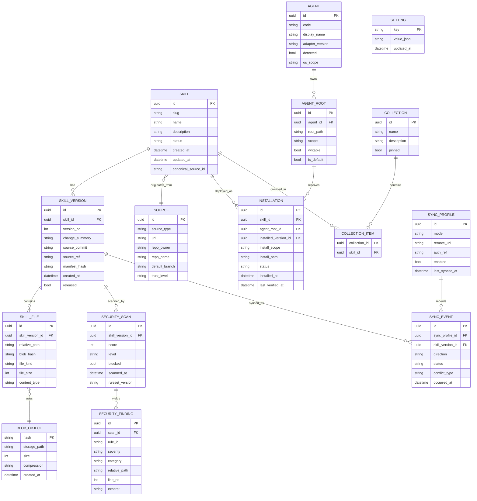
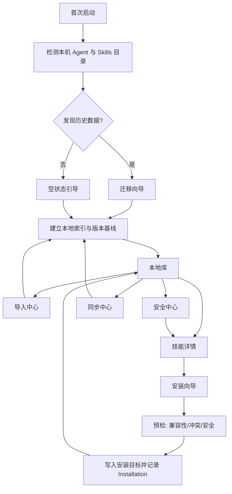

# 本地桌面 Skills 管理器产品功能规格研究报告

## 执行摘要

本次评审的四个 GitHub 仓库，实际上代表了四种不同的产品路线。**OpenSkills** 更像“跨 Agent 的技能安装与加载核心层”，它提供统一的命令行工作流和对多种 AI coding agent 的兼容，但并不试图做桌面 UI、用户账号体系或本地知识库；**Skills-Manager** 则呈现为“本地优先的桌面成品仓库”，README、隐私政策和发布信息都较完整，但当前公开仓库内容几乎只有文档与许可证，缺少可审计的源码；**skillhub-desktop** 是四者中功能最广的一个，已经走到“多 Agent 检测 + 发现页 + 收藏 + OAuth + 同步 + 用户托盘”的平台方向；**skills-manager-client** 则最强调“本地治理”，围绕 Claude Code 的本地扫描、GitHub 导入、安全扫描和项目路径配置做得最实用，但产品边界仍偏单一 Agent。citeturn1view0turn1view1turn1view2turn1view3turn13view1turn34view1

如果把“构建一个新的本地桌面 skills 管理器”作为目标，这四个仓库都提供了可借鉴部分，但**没有一个同时满足**以下五点：规范化本地数据模型、完整离线优先同步、跨 Agent 适配层、可扩展插件接口、以及可验证的安全与发布基线。OpenSkills 证明了“技能格式兼容层”是可行的；skillhub-desktop 证明了“多 Agent 桌面控制台”有真实需求；skills-manager-client 证明了“本地导入与安全扫描”是核心刚需；而 Skills-Manager 则提示了“离线、隐私、轻量 UX”对终端用户极有吸引力。citeturn39view1turn39view2turn13view1turn20view0turn20view4turn36view5turn36view8turn11view0turn0search1

基于以上分析，**建议的新产品定位**应是：一个**本地优先、跨 Agent、带版本历史与安全中心、同步可选而非强制账号**的桌面 Skills 管理器。它应把“Agent 安装目录”视为外部投影，而不是唯一事实源；真正的事实源应当是本地数据库和内容哈希仓库。这样才能避免现有仓库中普遍存在的“状态散落在 localStorage、JSON 配置和 Agent 文件夹里”的问题。citeturn11view0turn20view0turn20view4turn28view1turn38view0turn38view4turn39view2

主要评审对象如下：OpenSkills citeturn1view0，Skills-Manager citeturn1view1，SkillHub Desktop citeturn1view2，skills-manager-client citeturn1view3。

## 仓库逐一评审

下文采用同一评审口径：**若当前公开仓库无法验证某一维度，就明确标注“未能从公开源码验证”**，而不做猜测。

### OpenSkills

OpenSkills 的定位非常清晰：它是一个“通用 skills 加载器”，面向 Claude、Gemini CLI、Cline、Continue、OpenCode、Windsurf、Aider、Amp、Codex CLI、RooCode 等多类 AI coding agent，提供 `add / list / load / unload / remove` 等 CLI 工作流；安装方式是通过 `npx openskills@latest` 运行，而不是桌面安装包。citeturn1view0turn39view1

| 维度 | 观察 |
|---|---|
| 用途与范围 | 这是一个跨 Agent 的 CLI 工具，核心职责是把 Anthropic `SKILL.md` 格式技能安装并加载到不同 agent，而不是桌面管理器。citeturn1view0turn39view1 |
| 架构与技术栈 | 仓库源代码目录仅包含 `commands`、`utils`、`cli.ts`、`types.ts`，`package.json` 显示它是一个 TypeScript ESM 包，使用 `tsup` 构建、`vitest` 测试，产物入口为 `dist/cli.js`。citeturn39view0turn39view1 |
| 数据模型与 Schema | 没有看到独立数据库或应用 schema；其“数据模型”本质上是 skill 目录与 `SKILL.md` 约定，以及不同 agent 的目标目录规则。citeturn1view0turn39view0 |
| 本地存储与同步 | 没有独立应用态存储，也没有账号同步。公开安全策略明确写到：通过 HTTPS `git clone` 公共仓库安装 skill，使用临时目录，并在安装后清理。citeturn39view2 |
| UI/UX 流程 | 纯命令行流程：发现仓库 → `add` 安装 → `list` 查看 → `load/unload` 管理生命周期；不存在桌面屏幕流、信息架构或图形化工作台。citeturn1view0 |
| 功能特征 | 亮点是 agent 兼容层与统一命令；缺点是没有本地库、收藏、版本历史、安全中心、项目配置、可视化导入导出。citeturn1view0turn39view0 |
| 扩展性与插件 | 扩展性来自“增加更多 agent 目录/命令适配”，但并没有显式插件 API；从源码结构看，更像内部模块扩展，而不是第三方可装插件。citeturn39view0 |
| 安全与隐私 | 安全文档强调仅默认安装公共仓库、清理临时目录、建议用户审查 `SKILL.md` 和可执行脚本内容；这属于“供应链提醒”，不是深度安全执行沙箱。citeturn39view2 |
| 构建与运行状态 | 构建链、测试链和预发布检查都写在 `package.json` 中，说明从源码构建是清晰且可验证的。citeturn39view1 |
| 许可证与维护度 | `package.json` 标明 Apache-2.0；GitHub 搜索结果显示仓库在 2026-05-22 仍有更新，整体成熟度高。citeturn39view1turn0search0 |
| 值得关注的模块 | `commands/`、`utils/`、`cli.ts`、`types.ts` 是最关键的可复用边界。citeturn39view0 |

**结论**：OpenSkills 最值得借鉴的是“**跨 Agent 安装/加载标准层**”，但它并不是本地桌面产品的直接蓝本。citeturn1view0turn39view0

### Skills-Manager

Skills-Manager 的 README 与隐私政策给人的产品信号很强：它定位为**高效、安全、本地优先**的桌面程序，面向 Claude Code / Codex Skills 管理，强调多路径管理、Command Palette、快捷键、外部编辑等生产力体验；README 还明确写了 Tauri 2、React 19、Tailwind CSS v4、Radix UI。citeturn0search1turn1view1

| 维度 | 观察 |
|---|---|
| 用途与范围 | 产品定位是本地优先桌面 skills 文件管理器，偏终端用户效率工具，而非社区平台或同步平台。citeturn0search1turn1view1 |
| 架构与技术栈 | README 标注 Tauri 2.0、React 19、Tailwind CSS v4、Radix UI；但当前公开仓库文件树只有 README、隐私政策和 LICENSE 等文档，直接访问 `src`、`src-tauri`、`package.json` 都返回 404，因此架构只能从 README 推断，不能从源码验证。citeturn1view1turn9view0turn9view1turn7view0turn7view1 |
| 数据模型与 Schema | 未能从公开源码验证。可确认的信息只有隐私政策中提到的配置文件和本地目录。citeturn11view0turn9view0turn9view1 |
| 本地存储与同步 | 隐私政策明确写明：配置文件保存在 `~/.skills-manager/config.json`，skill 数据保存在用户配置的本地目录；应用完全离线运行，不与后台服务器通信，除了通过 GitHub Releases 获取更新。citeturn11view0 |
| UI/UX 流程 | README/索引摘要显示它主打多位置管理、搜索、命令面板、快捷键、外部编辑；但由于源码未公开，实际页面结构、状态流与导航流无法审计。citeturn0search1turn1view1 |
| 功能特征 | 从公开文档可见，它强调“本地文件管理器式”体验，而不是 marketplace、云同步或安全扫描。citeturn0search1turn11view0 |
| 扩展性与插件 | 未能从公开源码验证，也没有看到插件接口文档。citeturn9view0turn9view1 |
| 安全与隐私 | 隐私立场非常清晰：不收集个人信息、行为统计、skills 内容或文件系统信息，并声明所有数据留在本机。citeturn11view0 |
| 构建与运行状态 | 公开页显示有桌面发行版本，GitHub 搜索结果显示最新版本为 `v1.2.0`，发布时间为 2026-03-18；但由于源码缺失，无法验证从源码构建的可重复性。citeturn0search1 |
| 许可证与维护度 | 根目录 LICENSE 为 MIT；提交历史页显示主分支公开提交量很少，但 2026-01-11 仍有更新，再加上 2026-03-18 的版本发布，说明项目有在维护，只是开源透明度不足。citeturn11view1turn6view3turn0search1 |
| 值得关注的模块 | 当前公开仓库里，最关键可审计文件其实只有 `README*`、`PRIVACY*` 和 `LICENSE`。这意味着它更像“发布与说明仓库”，而不是工程底座。citeturn1view1turn11view0turn11view1 |

**结论**：Skills-Manager 最有价值的启发是“**真正本地优先的产品叙事**”和“轻量效率型 UX”，但它**不是适合作为开放可继承底座的仓库**，因为当前公开内容不足以支撑架构审计。citeturn11view0turn9view0turn9view1

### SkillHub Desktop

SkillHub Desktop 是四者中**功能广度最大**、也最接近“多 Agent 技能平台”的项目。任务计划文档直接把它定义为“跨平台桌面应用，用于统一管理多个 AI coding 工具的 skills”，技术栈为 Tauri v2 + React 19 + TypeScript + Tailwind CSS，且已完成 Discover、Installed、Sync、Settings、OAuth 登录 UI、收藏同步、托盘等功能。citeturn13view1

| 维度 | 观察 |
|---|---|
| 用途与范围 | 目标是统一管理多个 AI coding 工具的 skills，并解决不同 agent 之间无法共享 skills 的问题。citeturn13view1 |
| 架构与技术栈 | 前端目录包含 `api / components / hooks / i18n / lib / pages / store / types / utils`；Rust 后端包含 `installer.rs / lib.rs / openclaw.rs / sync.rs / tools.rs`。`package.json` 与 `Cargo.toml` 显示前端是 React 19 + Router + Zustand + Radix/Tailwind，后端使用 Tauri 插件、`reqwest`、`tokio`、`sha2`、`regex` 等。citeturn12view0turn13view0turn8view0turn8view1 |
| 数据模型与 Schema | `types/index.ts` 定义了 `FavoriteSkill`、`SkillCollection`、`UserSkill`、`UserSkillFile`、`SkillVersion`、`MarketplaceSkill`、`SyncFile`、`SyncMeta` 等模型，说明它已经超出“只管理本地文件夹”的阶段，具备用户资产、版本、市场与同步元数据。citeturn27view2turn27view3turn28view0 |
| 本地存储与同步 | 状态存储使用 `zustand persist`，键名是 `skillhub-desktop-storage`，持久化主题、认证状态、用户、访问令牌、刷新令牌、收藏、集合、选中的工具与项目路径。同步侧使用 `sync.rs` 递归收集文件、计算 SHA-256、维护 `SyncMeta`，并提供历史与版本 API。citeturn20view0turn20view1turn20view3turn20view4turn28view1turn26view2 |
| 认证与联网 | `auth.ts` 明确存在 OAuth 桌面回调 `desktop://callback`、token exchange、refresh token、自动重试的 `authenticatedFetch`，并访问 `/api/v1/oauth/*` 接口获取 favorites、collections、userinfo、api keys、wallet 等。citeturn26view0turn25view2turn25view2turn23view1turn23view3 |
| UI/UX 流程 | 已完成的页面包括 Discover、Installed、Sync、Settings、Favorites，以及 OAuth 登录与托盘交互；`findings.md` 还显示 `SkillPlayground`、`SetupWizard`、`SkillDetail` 是大型组件，说明产品包含安装向导、详情预览与更复杂的交互面板。citeturn13view1turn13view2turn14view1 |
| 功能特征 | 任务计划写明已完成多工具检测（17 个工具）、SkillHub API 集成、发现页、安装页、同步页、设置页、OAuth、收藏同步与托盘；`tools.rs` 则把 tool 适配抽象为常量 `ToolConfig` 列表。citeturn13view1turn15view4turn28view2 |
| 扩展性与插件 | 它已经把多工具支持抽象成 adapter 配置，但仍是代码内置的 `ToolConfig` 常量，不是运行时插件。也就是说，它有“扩展点”，但还没有“插件系统”。citeturn15view4turn28view2 |
| 安全与隐私 | 一方面，它支持 token 刷新、文件哈希和版本历史；另一方面，公开 issue #11 报告了路径遍历、命令注入、过宽 Tauri 权限、明文凭证存储、CSP 关闭等问题，且仓库根目录缺少 `LICENSE` 文件，导致 GitHub 无法识别许可证。需要注意，这些是公开 issue 中的扫描结论，而非我这里重新复验后的定案。citeturn23view1turn28view1turn29view0turn30view0 |
| 构建与运行状态 | `TASK_PLAN.md` 明确写出“生产构建测试、自动更新、GitHub Releases 发布、CI/CD 配置”仍处于待开始阶段；同时存在 Windows 黑屏与安装失败 issue。说明产品功能前进较快，但发布工程成熟度还在追赶。citeturn13view1turn29view1 |
| 许可证与维护度 | 公开检索显示仓库在 2026-06-01 仍有更新，活跃度不错；但许可证层面存在“文档声称 MIT、仓库缺失 LICENSE 文件”的不一致。citeturn0search2turn29view0turn30view0 |
| 值得关注的模块 | 后端核心是 `tools.rs`、`sync.rs`、`installer.rs`、`lib.rs`；前端核心是 `api/auth.ts`、`api/skillhub.ts`、`api/sync.ts`、`store/index.ts`，以及 `SkillPlayground`、`SetupWizard`、`SkillDetail` 等大组件。citeturn13view0turn14view5turn21view0turn22view0turn21view2turn17view0turn13view2 |

**结论**：SkillHub Desktop 是**最接近“新产品全面形态”**的参照物，但它也暴露了平台化之后最典型的问题：**安全边界、许可证治理、构建发布成熟度、前端复杂度膨胀**。citeturn13view1turn13view2turn29view0turn30view0

### skills-manager-client

skills-manager-client 的定位也很明确：它是一个管理 Claude Code Skills 的桌面应用，支持系统级与项目级扫描、市场浏览、本地安装、GitHub 导入、本地文件夹导入，以及专门的安全扫描。与 skillhub-desktop 相比，它更像一个“**本地运营工具**”，而不是“带云平台属性的技能中心”。citeturn34view1turn34view2

| 维度 | 观察 |
|---|---|
| 用途与范围 | 根 README 定义它为桌面应用，支持 system-level / project-level skills 的浏览、安装、导入与安全扫描。citeturn34view1turn34view2 |
| 架构与技术栈 | README 给出完整栈：React 19、TypeScript、Vite 7、Tailwind CSS 3.4、DaisyUI 5.5、Zustand、React Router v7、Recharts、Tauri v2。Rust 侧核心是 `lib.rs` 与 `security.rs`。citeturn32view3turn32view0 |
| 数据模型与 Schema | 后端会从 `SKILL.md` 提取名称、描述、作者、版本，同时还会叠加“市场安装元数据”，例如中英文描述、来源、来源 URL、安装日期、commit hash。也就是说，它以文件系统为主事实源，并在本地补充 sidecar 元数据。citeturn37view0 |
| 本地存储与同步 | 系统级 skills 目录默认是 `~/.claude/skills`，项目级目录是 `[project]/.claude/skills`；项目路径配置写入 `~/.claude/skill-manager-config.json`。没有发现账号体系或云同步逻辑。citeturn34view2turn38view0turn38view4 |
| UI/UX 流程 | `pages/` 目录里有 `Dashboard`、`Marketplace`、`MySkills`、`Security`、`Settings`，但当前 `App.tsx` 路由只实际暴露了 `my-skills`、`marketplace`、`settings` 三条路由。这说明页面设计已经超过当前导航实现，产品整合尚未完全收口。citeturn40view0turn41view0 |
| 功能特征 | 后端命令包括本地扫描、读取 skill、GitHub 导入、全量安全扫描、项目路径管理、软链接状态检查等；README 还提供 macOS/Windows 下载包与源码运行方式。citeturn37view0turn36view0turn37view5turn37view6turn32view3 |
| 扩展性与插件 | 当前扩展性主要体现在：GitHub 仓库导入、本地文件夹导入，以及对不同安装路径/软链接代理的支持；但并没有看到运行时插件 API。citeturn37view0turn38view0 |
| 安全与隐私 | 这是四个仓库里**安全模块最重**的一个。`security.rs` 定义了 `SecurityIssue`、`SecurityReport` 以及大量正则规则，覆盖破坏性命令、命令注入、外联/传输、系统敏感文件和 SSH 密钥访问等；最终会计算 0–100 的安全分，并映射到 `safe / low / medium / high / critical`。citeturn36view5turn36view7turn36view8 |
| 构建与运行状态 | README 给出了 `npm install`、`npm run tauri dev`、`npm run tauri build` 的标准流程，并列出 macOS 与 Windows 的打包产物名称。citeturn32view3 |
| 许可证与维护度 | README 标明 MIT；GitHub 搜索显示它在 2026-01-05 有更新并发布版本。成熟度中等偏上，但活跃节奏明显低于 OpenSkills 和 skillhub-desktop。citeturn32view3turn0search3 |
| 值得关注的模块 | `src-tauri/src/security.rs`、`src-tauri/src/lib.rs`、`pages/MySkills.tsx`、`Marketplace.tsx`、`Settings.tsx`、`useSkillStore.ts` 是最值得看的模块边界。citeturn32view0turn40view0turn41view1 |

还需要特别指出一个维护一致性问题：根 README 写的是“浏览 **75,691+** open-source skills”，而 `docs/README_CN.md` 仍写“**31,767** 个技能”，且后者的文档叙事更像一个可复制到 `~/.claude/skills/` 的 skill 包，而不是桌面客户端。这说明仓库文档中混入了历史项目/伴生项目内容。citeturn34view1turn35view0

**结论**：skills-manager-client 是四个仓库里**最实用的本地工具型参照物**，尤其适合借鉴它的导入、扫描与安全中心思路；但它仍偏 Claude Code 单一生态，而且信息架构与文档一致性还不够收敛。citeturn34view1turn36view5turn41view0turn35view0

## 横向比较与关键差距

### 对比表

| 仓库 | 主要特征 | 存储方式 | 平台 | Auth / Sync | UI 框架 | 语言 | 许可证 | 成熟度判断 |
|---|---|---|---|---|---|---|---|---|
| OpenSkills | 跨 Agent CLI；统一命令安装/加载；适配多类 agent。citeturn1view0turn39view0 | 无独立应用数据库；skill 目录与 `SKILL.md` 为主，安装通过 GitHub clone + 临时目录。citeturn39view2 | Node CLI，强调跨 agent 环境而非桌面。citeturn1view0turn39view1 | 无账号、无云同步。citeturn39view2 | 无桌面 UI。citeturn1view0 | TypeScript。citeturn39view1 | Apache-2.0。citeturn39view1 | **高**：核心边界清晰、测试/构建链完整、持续更新。citeturn39view1turn0search0 |
| Skills-Manager | 本地优先桌面文件管理；强调命令面板、快捷键、外部编辑。citeturn0search1turn1view1 | `~/.skills-manager/config.json` + 用户配置的本地目录。citeturn11view0 | README/发布信息可验证 macOS 与 Windows；Linux 未从当前仓库源码验证。citeturn0search1turn1view1 | 完全离线，无后台；仅更新下载涉及网络。citeturn11view0 | README 标注 React 19 + Tailwind CSS v4 + Radix UI，但源码未公开。citeturn1view1turn9view0turn9view1 | README 标注前端栈；源码语言不可审计。citeturn1view1turn7view0turn7view1 | MIT。citeturn11view1 | **中低**：产品完成度看起来不低，但开源透明度低，无法做工程级复用。citeturn1view1turn9view0turn9view1turn6view3 |
| skillhub-desktop | 多 Agent 检测、Discover/Installed/Sync/Settings/Favorites、OAuth、托盘、用户托管市场。citeturn13view1turn13view3 | Zustand persist + 本地文件目录 + `SyncMeta` / 文件哈希。citeturn20view0turn20view4turn28view1 | 目标是 macOS / Windows / Linux，但生产构建测试仍待完成。citeturn13view1 | 有 OAuth、refresh token、favorites/collections、版本/历史 API、同步中心。citeturn23view1turn25view2turn26view2 | React 19 + Tailwind + Radix/shadcn 迁移中。citeturn8view0turn13view2 | TypeScript + Rust。citeturn8view0turn8view1 | 文档声称 MIT，但仓库缺失 LICENSE 文件。citeturn29view0turn30view0 | **中高**：功能最全面，但安全、许可和发布工程仍有明显债务。citeturn13view1turn29view0turn29view1 |
| skills-manager-client | 本地扫描、市场浏览、GitHub 导入、本地导入、安全扫描、项目路径配置。citeturn34view1turn37view0 | 文件系统 + `~/.claude/skill-manager-config.json` + SKILL.md 解析 + 本地元数据。citeturn38view0turn38view4turn37view0 | 明确支持 macOS / Windows，README 列出打包文件。citeturn32view3 | 无账号、无云同步；以本地导入和 GitHub clone 为主。citeturn34view1turn37view0 | React 19 + Tailwind + DaisyUI。citeturn32view3 | TypeScript + Rust。citeturn32view3turn32view0 | MIT。citeturn32view3 | **中**：本地功能实用，安全模块强，但单一 Agent 倾向明显，且页面路由与文档存在收口问题。citeturn41view0turn35view0turn36view5 |

### 关键差距

四个仓库里，**没有一个真正把“本地数据库”和“Agent 安装目录”分开**。OpenSkills 不做数据库；Skills-Manager 公开隐私文档里只提 `config.json + 本地目录`；skillhub-desktop 把大量状态持久化进 localStorage，同时配合目录扫描和同步元数据；skills-manager-client 则把项目路径写进 `~/.claude/skill-manager-config.json`，技能本体仍以文件夹和 `SKILL.md` 为中心。对一个想支持历史、冲突解决、批量治理、审计和迁移的新产品来说，这样的存储层仍然太“散”。citeturn39view2turn11view0turn20view0turn20view4turn28view1turn38view0turn38view4

第二个明显缺口是**扩展性仍然主要靠硬编码**。OpenSkills 通过 commands / utils 组织能力，skillhub-desktop 通过 `ToolConfig` 常量表扩展 17 类工具，skills-manager-client 也是围绕固定目录和命令扩充。这意味着“支持更多 agent”是可行的，但“允许第三方以插件方式无侵入接入”还没有被真正实现。citeturn39view0turn15view4turn28view2turn37view0

第三个缺口是**安全基线不一致**。skills-manager-client 有最系统化的安全扫描引擎；OpenSkills 有基本的供应链安全声明；skillhub-desktop 的公开 issue 却暴露出路径遍历、权限过宽、凭证明文等高风险问题；Skills-Manager 虽然隐私叙事出色，但因为源码缺失，无法验证其安全实现。新产品应把“安全扫描、最小权限、Keychain/Keyring、路径规范化、严格导入校验”纳入第一天的产品要求，而不是上线后再补。citeturn36view5turn36view7turn36view8turn39view2turn29view0turn11view0turn9view0turn9view1

第四个缺口是**产品治理与文档一致性**。skillhub-desktop 有功能领先但许可缺失的治理问题；skills-manager-client 存在 README 与中文 docs 口径不一致、页面存在但路由未接入的问题；Skills-Manager 则是发布信息与源码透明度脱节。对新产品而言，工程规范本身应该视作产品需求的一部分。citeturn29view0turn30view0turn35view0turn41view0turn1view1turn9view0turn9view1

## 新产品功能规格

### 产品定位与范围边界

建议的新产品名称暂定为 **Local Skills Studio**。它不是单纯的“某个 agent 的 skills 文件浏览器”，而应是一个**本地优先的跨 Agent skills 管理平台**。其核心边界有三条：

第一，**本地优先**。默认不需要账号、不依赖云端、不上传技能内容；联网只在用户明确启用“镜像源、同步、更新检查、GitHub 导入”等能力时发生。这个方向直接吸收了 Skills-Manager 的隐私立场，也修补了 skillhub-desktop 把大量持久态放在 localStorage 与云接口之上的风险。citeturn11view0turn20view0turn23view1

第二，**跨 Agent，而非单一生态**。OpenSkills 已经证明跨 Agent 的 skills 安装抽象是成立的，skillhub-desktop 进一步证明“多工具检测 + 多目标安装”是有产品价值的。因此新产品应从 Day 1 把 Agent Adapter 作为一等概念，而不是把 `.claude/skills` 写死在核心逻辑里。citeturn1view0turn13view1turn15view4turn28view2

第三，**本地事实源优先于目录投影**。Agent 的 skill 目录应被视为“部署目标”，而不是唯一数据源；新产品真正的事实源应是本地数据库、版本对象和内容哈希仓库。这样才能支持历史、草稿、冲突解决、撤销回滚、跨 Agent 多目标部署，以及比当前仓库更可靠的迁移能力。这个设计是对现有仓库分散存储模式的直接修正。citeturn11view0turn20view4turn28view1turn38view4turn39view2

**不在首版范围内**的内容也应明确：首版不做公开云 marketplace 运营后台，不执行/托管任意 skill 运行时，不把插件脚本开放到完全无沙箱的宿主环境中。

### 用户画像

| 用户画像 | 目标 | 当前痛点 | 首版必须满足 |
|---|---|---|---|
| 独立开发者 | 在多个 AI coding agent 之间复用 skill，并本地留档 | skill 分散在不同目录；安装/升级/卸载容易混乱 | 自动检测 agent、统一库视图、一键安装/卸载、版本历史 |
| 团队技术负责人 | 维护团队推荐 skill 集合，向成员分发 | 缺少可审计版本、迁移和导出；不同成员路径不一致 | 集合、导出包、导入包、路径模板、变更审计 |
| 安全敏感用户 | 只在本地管理，不希望被遥测或上传 | 现有项目安全深度不一致；权限界面不透明 | 离线默认、权限最小化、安全扫描、Keychain 凭证管理 |
| Skill 作者/维护者 | 本地编写、预览、打包和发布 skill | 缺少统一编辑/预检/版本化流程 | 草稿、文件树、diff、发布包导出、校验清单 |

### 功能需求

建议把功能划分为**核心能力**和**高级能力**两层。核心能力服务于“本地管理闭环”，高级能力服务于“协作、同步与生态扩展”。

| 模块 | 核心能力 | 高级能力 |
|---|---|---|
| 本地库 | 自动扫描 agent skills 目录；统一技能卡片/列表视图；按名称、标签、来源、风险等级、适配 agent 过滤；详情页预览 `SKILL.md` 与文件树 | 全文搜索、语义搜索、本地收藏、集合、最近使用、使用频率统计 |
| 安装与部署 | 安装到个人级/项目级/多 agent；冲突检测；卸载；重装；重新链接 | 批量安装、策略模板、团队基线部署、只读锁定 |
| 导入 | 本地文件夹导入；Git URL 导入；ZIP/TAR 导入；从现有 agent 目录迁移 | 从历史工具配置自动发现导入源；仓库 sparse clone；离线镜像导入 |
| 版本管理 | 技能版本号、变更摘要、文件级 diff、回滚 | 分支草稿、发布通道、签名清单、版本比较报告 |
| 安全中心 | 路径遍历检查、可疑命令规则、联网/外传规则、敏感文件访问规则、评分与建议 | 签名验证、组织安全策略、白名单/豁免、企业规则包 |
| 同步 | 默认关闭；支持手动导出/导入包 | 可选 self-hosted REST sync、Git sync、共享文件夹 sync、冲突合并中心 |
| 扩展 | 预置 agent adapters | 外部 adapters、导入器、导出器、安全规则插件、同步驱动 |

### 数据模型

现有仓库的共同问题是“状态散、关系弱、历史薄”。因此新产品应从一开始就引入**规范化领域模型**，但把真实文件内容与元数据分层管理：元数据进入 SQLite，文件内容进入 content-addressed blob store，最终再投影到 agent 目录。这样既保留文件系统兼容性，又具备事务、查询与历史能力。这个方向是对 Skills-Manager 的 JSON 配置、skillhub-desktop 的 localStorage persist、skills-manager-client 的配置 JSON 与文件系统模型的结构化升级。citeturn11view0turn20view0turn20view4turn38view4



### 界面与流程

建议的首版信息架构如下：

| 屏幕 | 关键内容 | 核心操作 |
|---|---|---|
| 启动与迁移向导 | 自动检测已安装 agent、现有 skills 目录、旧工具配置 | 选择导入源、映射路径、执行首次索引 |
| 仪表板 | 最近变更、风险概览、待处理冲突、常用集合 | 打开库、继续未完成安装、进入同步中心 |
| 本地库 | 技能列表、过滤器、状态标记、安装覆盖面 | 搜索、批量安装、批量导出、批量扫描 |
| 技能详情 | `SKILL.md` 预览、文件树、版本、来源、风险、安装目标 | 安装、升级、卸载、比较版本、打开源目录 |
| 安装向导 | 目标 agent、范围、冲突预检、兼容性检查 | 安装到个人/项目/多 agent；创建链接或复制 |
| 导入中心 | 本地文件夹、Git URL、压缩包、旧工具迁移 | 导入、预检、合并重复 skill |
| 安全中心 | 扫描队列、风险得分、规则详情、豁免列表 | 重新扫描、阻止安装、批准或豁免 |
| 同步中心 | 本地变更、远端差异、冲突条目、同步日志 | 推送、拉取、选择策略、恢复版本 |
| 设置 | 路径、镜像源、凭证、更新、隐私、插件 | 配置 agent roots、keyring、日志级别、插件目录 |

对应的核心流程建议如下：



### 离线优先同步策略

新产品的同步策略必须是**offline-first**，而不是“先设计云 API，再本地缓存”。建议采用四层模型：

第一层是**本地事实源层**：SQLite 保存技能、版本、安装、扫描、同步日志等实体；blob store 保存文件内容；所有写操作先落本地事务。

第二层是**目录投影层**：把某个 `SkillVersion` 投影到 agent 的实际目录中。投影方式可选“复制”“硬链接”“符号链接”“镜像导出”。这一步只对部署目标生效，不回写为唯一数据源。

第三层是**变更队列层**：所有外部目录扫描和本地编辑都转化为标准化变更事件，进入 inbox/outbox。这样即便用户离线编辑、批量导入、跨目录迁移，也能统一冲突检测。

第四层是**可选远端层**：支持三种同步驱动，按复杂度从低到高依次为共享文件夹同步、Git 同步、self-hosted REST 同步。默认关闭，用户显式创建 `SyncProfile` 后才启用。

建议的冲突策略如下：
- 元数据冲突：采用字段级三方合并，冲突字段进入人工确认。
- 文件冲突：如果 `blob_hash` 不同且都发生于同一逻辑版本基础之上，生成“并行草稿版本”，不自动覆盖。
- 安装冲突：若目标 agent 目录已有同名其他来源技能，必须进入人工确认。
- 删除冲突：默认“软删除 + 可恢复”，避免因为目录投影删除误伤本地历史。

### 导入、导出与迁移

导入侧必须覆盖四类来源：

| 来源 | 识别方式 | 可迁移内容 | 说明 |
|---|---|---|---|
| OpenSkills | 扫描其安装到各 agent 的 skill 目录 | skill 文件、来源仓库、agent 覆盖关系 | 它没有独立库，因此主要做目录级迁移。citeturn1view0turn39view2 |
| Skills-Manager | 读取 `~/.skills-manager/config.json` 与其配置的本地目录 | 路径配置、已有 skills | 由于源码未公开，迁移适配器应按“配置 + 目录内容”保守实现。citeturn11view0turn9view0turn9view1 |
| skillhub-desktop | 读取本地工具目录、必要时读取本地持久态；云端资产通过重新授权拉取 | 选中工具、收藏/集合、本地已安装 skills、同步元数据 | 鉴于 token 持久化方式敏感，不建议直接迁移旧 token，应要求重新登录。citeturn20view0turn20view3turn28view0 |
| skills-manager-client | 读取 `~/.claude/skill-manager-config.json`、系统/项目目录与市场安装元数据 | 项目路径、来源 URL、commit hash、安装时间 | 它的本地元数据最适合用于初始归档。citeturn38view4turn37view0 |

导出侧建议提供三种格式：
- **Agent Bundle**：直接导出为可安装目录结构。
- **Signed Archive**：带 manifest 和可选签名的压缩包，适合团队内部分发。
- **Git-ready Export**：按标准目录导出，便于进入自托管仓库。

### 安全、隐私与扩展接口

安全与隐私要求建议写成“红线条款”，而不是普通 backlog：

- 默认不上传技能内容、不启用遥测、不强制账号。
- 所有远端凭证一律写入 OS Keychain / Credential Manager / Secret Service，而不是 localStorage 或普通 JSON 文件。
- 所有导入路径、解压路径、安装路径、同步写入路径都要经过 canonicalize 与越界校验。
- 默认最小化 Tauri 权限，不申请笼统的 `fs:*` 或高风险 shell 权限。
- 安全扫描分为**安装前扫描**与**存量巡检**两种模式；高危规则可阻止安装。
- 日志默认脱敏，API key、token、路径快照都只显示必要片段。

扩展接口建议采用**宿主稳定 API + 插件能力分级授权**。最重要的不是先做“脚本能做任何事”，而是先定义清楚哪些能力可被扩展：

```ts
interface AgentAdapter {
  id: string
  displayName: string
  detect(): Promise<AgentDetection[]>
  listRoots(): Promise<AgentRoot[]>
  validateBundle(bundle: SkillBundle): Promise<ValidationResult>
  install(input: InstallRequest): Promise<InstallResult>
  uninstall(input: UninstallRequest): Promise<UninstallResult>
  verify(input: VerifyRequest): Promise<VerifyResult>
}

interface ImportProvider {
  id: string
  canHandle(input: ImportSource): Promise<boolean>
  preview(input: ImportSource): Promise<ImportPreview>
  import(input: ImportSource): Promise<ImportedSkill[]>
}

interface SyncDriver {
  id: string
  push(changes: LocalChangeSet): Promise<SyncReport>
  pull(cursor?: string): Promise<RemoteChangeSet>
}
```

插件权限应声明为：`read_agent_dirs`、`write_agent_dirs`、`network_github_only`、`network_custom`、`security_rules`、`sync_driver` 等。用户在安装插件时明确授权，且插件默认不拿到宿主全部文件系统权限。

## 技术栈建议与实施路线

### 技术栈方案比较

三款桌面项目里，有三款都采用了 **Tauri + React + TypeScript** 这一组合；OpenSkills 则证明 Node/TypeScript 非常适合做导入器与安装器逻辑。因此，新的本地桌面应用最稳妥的路线仍然是 **Tauri 2 + React 19 + TypeScript + Rust**，但应把“轻量 UI 状态”和“正式持久化数据”分开：前者可以继续用 Zustand，后者必须升级到 SQLite。citeturn1view1turn13view1turn32view3turn39view1turn20view0turn38view4

| 方案 | 组成 | 优点 | 风险/代价 | 结论 |
|---|---|---|---|---|
| 推荐方案 | **Tauri 2 + React 19 + TypeScript + Rust + SQLite + Tailwind + Radix/shadcn** | 与现有桌面仓库路径一致；文件系统访问、打包、系统托盘、原生能力都成熟；适合本地工具；Rust 适合做路径安全、扫描、同步和 hash 计算 | 需要前后端边界设计得更严谨；权限治理不能偷懒 | **首选** |
| 备选方案 | Electron + React + Node + SQLite | JS 生态插件能力更强；前端与扩展开发门槛更低 | 包体与资源占用通常更高；宿主权限管理更容易失控 | 若团队完全偏 JS，可采用 |
| 最小改造方案 | 以 OpenSkills 为核心 + 薄桌面壳 | 交付快，可快速获得跨 Agent 安装能力 | 很难补齐数据库、历史、安全中心、可视化流程 | 只适合做原型，不适合正式产品 |

**推荐落地栈**可以细化为：
- 宿主：Tauri 2
- UI：React 19 + TypeScript + React Router
- 状态：Zustand 只管 UI 偏好、临时选择与会话态
- 持久化：SQLite（开启 FTS5），由 Rust 侧统一读写
- 文件内容：content-addressed blobs
- 安全：OS keyring、严格路径规范化、可审计命令执行白名单
- 组件：Tailwind + Radix/shadcn
- 后端能力：Rust adapters、importers、sync drivers、security scanner
- 自动更新：签名更新，默认关闭自动下载，仅提示新版本

### 测试与部署计划

| 测试/交付层 | 范围 | 目标 |
|---|---|---|
| 单元测试 | parser、adapter、path sanitizer、diff engine、security rules、db migrations | 每个领域模块独立可验证 |
| 集成测试 | 扫描真实目录夹具、Git 导入、ZIP 导入、安装/卸载、回滚 | 覆盖 `.claude`、`.gemini`、`.opencode` 等典型目录 |
| 端到端测试 | 首次启动、迁移、安装、冲突、同步、安全拦截 | 用桌面自动化验证完整用户路径 |
| 安全测试 | 路径遍历、命令注入、zip slip、token 存储、权限边界 | 每次发布前强制执行 |
| 性能测试 | 大规模 skills 索引、批量扫描、批量导出 | 防止 UI 在仓库规模上升后性能退化 |
| 发布工程 | GitHub Actions、macOS 签名/公证、Windows 签名、Linux 包 | 形成稳定的 nightly / beta / stable 渠道 |

部署层面的关键要求是：**先把发布可靠性产品化，再把自动更新产品化**。这是从 skillhub-desktop 当前“功能先行、发布工程待补”的经验中直接得出的约束。citeturn13view1turn29view1

### 路线图与估算

| 阶段 | 目标 | 关键交付 | 估算 |
|---|---|---|---|
| 基础平台 | 宿主、数据库、索引器、最小 UI 壳 | 本地库、设置、Agent 检测、首批 adapters、SQLite schema、索引任务 | **中** |
| MVP 管理闭环 | 实现“扫描—详情—安装—卸载—导入—导出”闭环 | 技能详情、安装向导、项目/个人双作用域、Git/本地导入、导出包 | **中** |
| 安全基线 | 把安全作为首发能力，而不是附属页 | 安装前扫描、批量巡检、风险得分、路径安全与凭证托管 | **中** |
| 版本与回滚 | 完成规范化历史能力 | 版本对象、diff、回滚、清单 hash、草稿 | **高** |
| 离线优先同步 | 引入可选同步，而不破坏本地优先 | outbox/inbox、冲突中心、self-hosted sync driver、Git sync driver | **高** |
| 插件与生态 | 开放 agent adapters、导入器、同步驱动 | 插件 manifest、权限模型、签名校验、插件目录管理 | **高** |
| 团队能力 | 面向小团队与组织应用 | 集合模板、策略分发、团队基线包、批准流 | **高** |

一个更务实的优先级排序是：

- **P0**：本地库、Agent 检测、导入导出、安装/卸载、SQLite、路径安全、Keychain。
- **P1**：安全中心、版本历史、批量操作、集合。
- **P2**：可选同步、冲突处理、自托管接口。
- **P3**：插件 SDK、团队分发与审批。

### 主要来源

以下均为本次分析直接使用的主仓库来源与相关文件页面：

- OpenSkills 仓库首页与 README/源码文件树。citeturn1view0turn39view0turn39view1turn39view2
- Skills-Manager 仓库首页、隐私政策、许可证与文件树。citeturn1view1turn11view0turn11view1turn9view0turn9view1
- SkillHub Desktop 仓库首页、任务计划、源码目录、类型/存储/API/同步实现、公开 issues。citeturn1view2turn13view1turn13view2turn8view0turn8view1turn20view0turn28view1turn29view0turn29view1turn30view0
- skills-manager-client 仓库首页、README、中文文档、页面路由、Rust 后端与安全模块。citeturn1view3turn32view3turn35view0turn40view0turn41view0turn33view0turn33view1 |

**最终建议**可以浓缩成一句话：**不要把新产品做成“又一个扫描目录的 GUI”，而要做成“本地优先的 skills 操作系统”**。从这四个仓库看，真正稀缺的不是再多一个列表页，而是一个把**跨 Agent 兼容、结构化本地事实源、安全治理、版本历史、可选同步和扩展接口**放进同一架构里的桌面产品。citeturn1view0turn13view1turn36view5turn11view0turn20view4